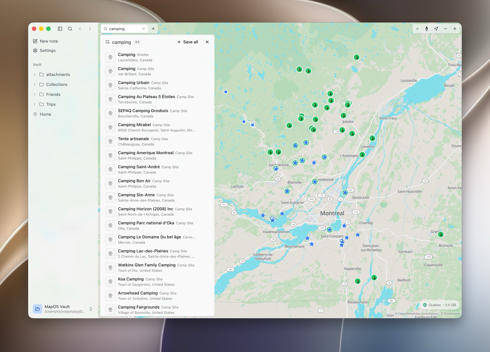

# MapOS

**The connected map for you and your agents.**

Your places, notes, and AI on one map. Markdown, no accounts, offline.



## Install

Free, no account, Apple Silicon only. No telemetry or analytics.

**[Download from mapos.md](https://mapos.md)**

Download a region pack and the basemap, search, and routing all run offline.

## Development

Node 22 and pnpm.

```sh
pnpm install
pnpm dev          # the desktop app
pnpm typecheck
pnpm test
pnpm check        # Biome lint + format
```

See [CONTRIBUTING.md](CONTRIBUTING.md) for conventions and how to submit changes.

## Built on

[OpenStreetMap](https://www.openstreetmap.org/copyright) ·
[MapLibre](https://maplibre.org) ·
[Protomaps](https://protomaps.com) ·
[Photon](https://photon.komoot.io) ·
[Valhalla](https://github.com/valhalla/valhalla) ·
[Geofabrik](https://www.geofabrik.de) ·
[Natural Earth](https://www.naturalearthdata.com) ·
[Wikidata](https://www.wikidata.org)

Map data © OpenStreetMap contributors, available under the
[Open Database License](https://www.openstreetmap.org/copyright).

## License

[Apache-2.0](LICENSE)

## Contact

[hello@mapos.md](mailto:hello@mapos.md)
